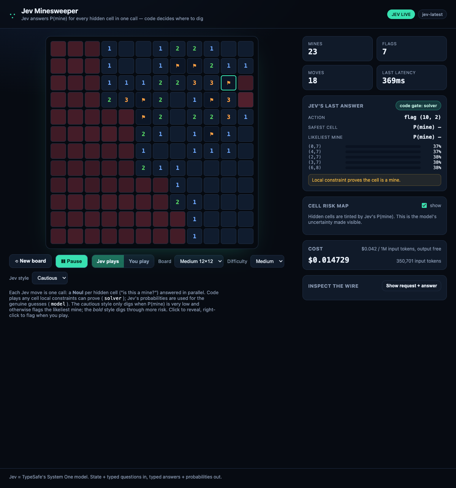

# jev-minesweeper

Minesweeper played by **[Jev](https://docs.typesafe.ai)**, TypeSafe AI's System One model.

Jev is a decision model, not an LLM: you send a state plus typed questions and it returns typed
answers with calibrated probabilities, no text generation. Minesweeper is a natural fit because the
game _is_ a probability estimate — and Jev answers it natively.

Each move, in **one request**, Jev answers a `Noul` for every hidden cell: _"is this cell a mine?"_
That is a full probability map in a single parallel call. Application code then owns the move.



```text
board (revealed numbers, flags) ──► Jev: one Noul per hidden cell = P(mine)
                                          │  all answers in one parallel call
                                          ▼
                          code policy (persona): reveal / flag / forced guess
```

## What it demonstrates

- **Calibrated probability as the output.** The reliability of `P(mine)` is measurable: the eval
  harness bins predictions against outcomes and prints a reliability table.
- **High fan-out in one call.** A 9×9 board needs up to 81 independent questions; adding them
  barely changes latency because they are evaluated in parallel.
- **The model judges, code decides.** The `cautious` and `bold` personas are code thresholds over
  Jev's probabilities; the model never chooses the action itself.

## Run the game

```bash
git clone https://github.com/dbssman/jev-minesweeper.git && cd jev-minesweeper
cp .env.example .env        # paste your TYPESAFE_API_KEY (or just export it)
node server.mjs             # open http://127.0.0.1:4322
```

That is the whole setup: no dependencies, no build step, Node 20+. Without a key it runs the
deterministic baseline bot so the page still works (badge shows `SIMULATED`).

Play modes: **Jev plays** (pick a persona, press _Jev digs_) or **You play** (click to reveal,
right-click to flag). The _Cell risk map_ tints hidden cells by Jev's `P(mine)`.

### Board configuration

| Board  | Size  |
| ------ | ----- |
| Small  | 9×9   |
| Medium | 12×12 |
| Large  | 16×16 |

Difficulty sets the mine density: Easy 12%, Medium 16%, Hard 22%. Change either selector to start a
fresh board. The CLI takes explicit dimensions instead:

```bash
node run.mjs --width 12 --height 12 --mines 25 --policy jev:cautious
```

Large boards would need up to 256 questions per move, so the client asks at most
`MAX_QUESTIONS_PER_CALL` (120 in `src/jev.mjs`), most-constrained cells first. Raise or lower it
there to trade cost/latency against coverage.

### How a move is chosen

1. If local constraints prove a safe cell or a mine, code plays it (`solver`) — no guessing.
2. Otherwise Jev's `Noul` probabilities decide (`model` / `forced`), filtered by the persona
   thresholds.

Only step 2 depends on the model, which is exactly where probabilities add value over arithmetic.

## Evaluate Jev

```bash
node run.mjs --games 8 --policy jev:cautious --policy jev:bold --policy baseline
```

Plays the same seeded boards with each policy, then prints solve rate and — for the Jev policies —
a reliability table for `P(mine)`. A JSON report is written to `reports/`. `baseline` is a
deterministic local-constraint solver used both as a comparison and as Jev's fallback when a call
fails. Add `:pure` (e.g. `jev:cautious:pure`) to skip the solver and let Jev guess every move.

`Jev vs Jev` is meaningful here because the two personas share the seed, so their solve rates are
comparable, and the baseline shows whether Jev's probabilities beat arithmetic.

### Sample result (9×9, 10 mines, 4 shared seeds)

```
policy                 games   solved   rate    avg moves   jev calls
jev:cautious:pure      4       0        0.00    9.5         38
jev:bold:pure          4       0        0.00    2.5         10
jev:cautious           4       3        0.75    26.3        2
baseline               4       3        0.75    27.8        0

Calibration of P(mine):
bin        n     predicted   actual
0.3-0.4    954   0.36        0.23
0.4-0.5    836   0.43        0.26
```

Read that honestly, it is the interesting part:

- **Jev alone does not solve Minesweeper.** `:pure` modes let Jev's own `P(mine)` pick every cell,
  and it loses every board — a general decision model's probability estimate is not a solver.
- **Deduction is what wins.** `jev:cautious` and `baseline` both reach 3/4 because code proves most
  cells; on these seeds the solver needed Jev only twice.
- **`P(mine)` is only roughly calibrated here and over-estimates mines** (predicted 0.36 → actual
  0.23). Samples are also correlated (the same cells are re-asked as the board evolves), so treat
  the table as a sanity check, not a calibrated reliability curve. More boards and independent
  samples would be needed to make a real claim.

Two personas share a seed, so run `jev:cautious` vs `jev:bold` (or `:pure`) and compare their
`solved` columns to see how the code thresholds change behaviour.

## The personas (code, not prompt-only)

| Persona    | Reveal only if `P(mine)` ≤ | Flag if `P(mine)` ≥ | Behaviour                           |
| ---------- | -------------------------- | ------------------- | ----------------------------------- |
| `cautious` | 0.05                       | 0.40                | Avoids guessing; flags instead      |
| `bold`     | 0.55                       | 0.85                | Digs through more risk for progress |

The style line sent to the model nudges it; the thresholds above are the real behaviour and live in
`src/jev.mjs`.

## Data sent to TypeSafe

Per move: a compact JSON `state` (the board as text, size, mine count, flags placed, hidden count,
playing style) plus one `Noul` question per hidden cell with that cell's neighbourhood inline. No
personal data. The API key is read server-side only and never sent to the browser.

## Layout

- `src/engine.mjs` — pure Minesweeper (seeded RNG, safe first reveal, flood fill). Shared by the
  browser, server and CLI.
- `src/jev.mjs` — state/question building, TypeSafe client, personas, and calibration binning.
- `src/baseline.mjs` — deterministic local-constraint solver + random policy.
- `server.mjs` — static server + `POST /api/decide`; the only file that calls the API.
- `run.mjs` — headless evaluation harness.
- `public/` — the game and the probability panel.
- `test.mjs` — offline tests (no API key).

## Tests

```bash
node --test
```

Covers the engine (safe first reveal, flood fill, flags), the local-constraint baseline, the persona
policy gates, and calibration binning.

## Notes

- Jev reads text only and cannot reliably count, so all arithmetic and legality stay in code.
- Model `jev-latest`; log the versioned id from each response if you tune thresholds.
- Independent project; not affiliated with or endorsed by TypeSafe AI.

## License

MIT — see [LICENSE](./LICENSE).
